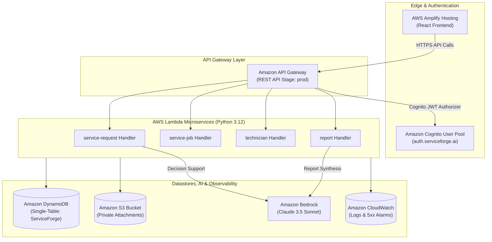

# ServiceForge AI — AWS Infrastructure-as-Code (AWS SAM)

## Overview
This directory contains the complete Infrastructure-as-Code (IaC) foundation for ServiceForge AI built using the **AWS Serverless Application Model (AWS SAM)**.

All resources strictly align with:
- `docs/ARCHITECTURE.md`
- `docs/DATA_MODEL.md`
- `docs/DATABASE_SPEC.md`
- `docs/API_SPEC.md`
- `docs/AI_SPEC.md`
- `docs/SECURITY_SPEC.md`
- `docs/DEPLOYMENT_SPEC.md`
- `docs/TESTING_SPEC.md`

> **IMPORTANT SAFETY NOTICE:** Foundation specification only. No live AWS cloud resources have been provisioned or deployed yet.

---

## AWS Architecture Diagram



---

## Foundation Resources Defined (`template.yaml`)

### 1. Amazon DynamoDB (`ServiceForgeTable`)
- **Table Name:** `ServiceForge` (or `TableName` parameter)
- **Billing Mode:** `PAY_PER_REQUEST` (On-Demand pricing for hackathon efficiency)
- **Partition Key (`PK`):** String (`ORG#<orgId>#<EntityType>#<Id>`)
- **Sort Key (`SK`):** String (`METADATA`, `AI_ANALYSIS`, `UPDATE#<timestamp>`, `REPORT`)
- **Global Secondary Indexes:**
  - `GSI1` (`GSI1PK` / `GSI1SK`) — Multi-entity status and technician dispatch lookups.
  - `GSI2` (`GSI2PK` / `GSI2SK`) — Priority alerts and SLA deadline auditing.
- **Security & Durability:** Encryption at rest enabled, Point-in-Time Recovery (PITR) enabled.

### 2. Amazon S3 (`ServiceForgeAttachmentsBucket`)
- **Bucket Name:** `serviceforge-ai-attachments-${AccountId}-${Region}`
- **Security:** `BlockPublicAccess = true` across all ACLs and policies; Server-Side Encryption (`AES256`).
- **Use Cases:** Stores attached diagnostics, audio logs, and generated Service Completion PDF reports. Access via 15-minute presigned URLs.

### 3. Amazon Cognito (`ServiceForgeUserPool` & `ServiceForgeUserPoolClient`)
- **User Pool:** Managed identity directory supporting email sign-in.
- **Custom Claims:** `custom:role` (`ADMIN`, `SERVICE_MANAGER`, `DISPATCHER`, `TECHNICIAN`, `CUSTOMER`) and `custom:org_id` (`ORG#<orgId>`).
- **RBAC Groups:** Explicit user pool groups created for all 5 security roles.

### 4. Amazon API Gateway (`ServiceForgeApi`)
- **Type:** Serverless REST API Stage
- **Authorizer:** `CognitoAuthorizer` inspecting `Authorization: Bearer <JWT_TOKEN>`.
- **CORS:** Pre-configured for web portal access (`GET,POST,PATCH,OPTIONS,PUT,DELETE`).

### 5. AWS Lambda Microservices (Python 3.12)
- `ServiceRequestFunction` (`../Backend/functions/service-request/`)
- `ServiceJobFunction` (`../Backend/functions/service-job/`)
- `TechnicianFunction` (`../Backend/functions/technician/`)
- `ReportFunction` (`../Backend/functions/report/`)
- **Environment Variables:** `DYNAMODB_TABLE_NAME`, `S3_BUCKET_NAME`, `BEDROCK_MODEL_ID`, `LOG_LEVEL`.

### 6. Amazon CloudWatch Log Groups & Alarms
- Individual Log Groups (`/aws/lambda/ServiceForge-*`) with 30-day retention.
- CloudWatch Alarm (`ServiceForgeApi5xxErrors-prod`) monitoring API Gateway 5xx rates.

### 7. Amazon Bedrock Configuration & IAM Least Privilege
- Dedicated IAM Managed Policy (`BedrockInvocationPolicy`) restricting Lambda access strictly to `bedrock:InvokeModel` for `anthropic.claude-3-5-sonnet-20241022-v2:0` and `anthropic.claude-3-haiku-20240307-v1:0`.

---

## Directory Structure

```
Infrastructure/
├── template.yaml               # Primary AWS SAM Serverless Infrastructure Specification
├── samconfig.toml.example      # AWS SAM CLI Deployment Parameters Template
├── README.md                   # Infrastructure & Deployment Guide
└── policies/
    ├── bedrock_invoke_policy.json   # IAM Policy: Bedrock Model Invocation
    ├── dynamodb_crud_policy.json    # IAM Policy: Single-Table DynamoDB Access
    └── s3_attachments_policy.json   # IAM Policy: Private S3 Attachments Access
```

---

## Local Validation Instructions

Before executing any CloudFormation or SAM deployments:

```bash
# 1. Validate SAM Template Syntax
sam validate -t Infrastructure/template.yaml

# 2. Build Serverless Package Locally
sam build -t Infrastructure/template.yaml

# 3. Dry-Run / Guided Deployment (Requires Explicit Approval)
sam deploy --template-file Infrastructure/template.yaml --config-file Infrastructure/samconfig.toml.example --guided
```
