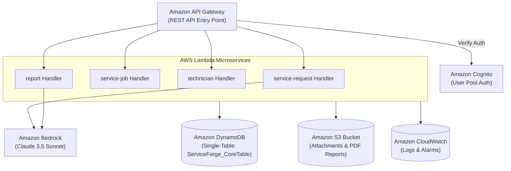

# ServiceForge AI — Cloud Infrastructure Architecture

## Overview
This directory is designated for AWS Infrastructure-as-Code (IaC) templates, CloudFormation / AWS SAM / CDK configurations, and deployment specifications for ServiceForge AI.

> **Status Notice:** Infrastructure foundation specification only. No live AWS cloud resources have been provisioned or deployed yet.

---

## Intended Target AWS Infrastructure

---

## Managed AWS Resources Breakdown

### 1. Amazon API Gateway
- **Type:** REST API Gateway
- **Function:** Handles public routing, CORS preflight headers, rate-limiting, and JWT authentication via Cognito User Pool Authorizer.

### 2. AWS Lambda
- **Runtime:** Python 3.12
- **Functions:**
  - `service-request`: Handles raw request intake and invokes Bedrock for structured decision support extraction.
  - `service-job`: Manages job creation, status transitions, and checklist execution.
  - `technician`: Handles skill matrix matching and live dispatch allocation.
  - `report`: Synthesizes completed job logs into client-facing PDF reports via Bedrock.

### 3. Amazon DynamoDB
- **Table Name:** `ServiceForge_CoreTable`
- **Pattern:** Single-Table Design with Partition Key (`PK`) and Sort Key (`SK`).
- **GSI Indexes:** `GSI1-PK` and `GSI1-SK` for multi-entity querying.

### 4. Amazon S3
- **Bucket:** `serviceforge-ai-attachments-ap-south-1`
- **Access Control:** Private bucket with server-side encryption (AES-256) and short-lived presigned URL access for field uploads and report downloads.

### 5. Amazon Bedrock
- **Models:** Claude 3.5 Sonnet (`anthropic.claude-3-5-sonnet-20241022-v2:0`)
- **Use Cases:** Unstructured text extraction, safety checklist generation, missing detail prompts, and executive summary writing.

### 6. Amazon Cognito
- **User Pool:** Managed user directory with custom claims (`custom:role`, `custom:org_id`) for Service Managers, Dispatchers, Technicians, and Customers.

### 7. Amazon CloudWatch
- **Logging:** Centralized log groups (`/aws/lambda/serviceforge-*`) for application tracing, error monitoring, and security audit logs.
