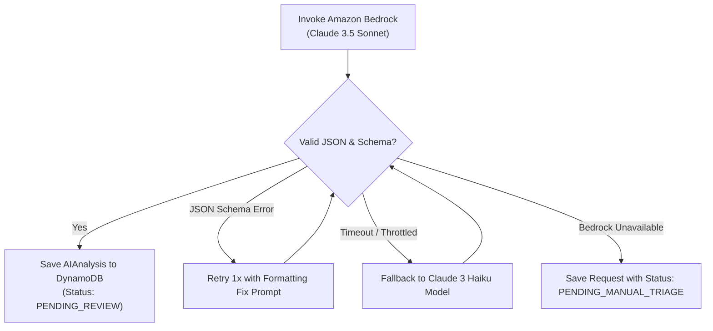

# ServiceForge AI — Amazon Bedrock AI Architecture & Prompts Specification

**Version:** 1.0.0  
**Project:** ServiceForge AI  
**AI Platform:** Amazon Bedrock  
**Primary Models:**
- `anthropic.claude-3-5-sonnet-20241022-v2:0` (Primary Reasoning, Triage & Report Generation)
- `anthropic.claude-3-haiku-20240307-v1:0` (Fast Triage & Classification Fallback)  

---

## 1. AI Decision Support & Safety Governance Principles

### 1.1 Decision Support Mandate
ServiceForge AI operates under a strict **Decision Support Paradigm**:
1. **No Automated Field Execution:** AI recommendations (suggested priority, tools, parts, safety rules) are generated as *suggestions* for human review.
2. **Explicit Separation:** UI strictly segregates raw customer inputs from AI-suggested diagnostic metadata.
3. **No Unconfirmed Diagnostic Claims:** Outputs frame potential root causes as *"Possible Causes for Inspection"* rather than definitive technical truths.
4. **Mandatory Human-in-the-Loop Review:** All AI extractions require Service Manager validation (`reviewStatus = APPROVED_BY_MANAGER`) before converting to an active `ServiceJob`.

---

## 2. Amazon Bedrock Guardrails & Safety Filters

ServiceForge AI configures **Amazon Bedrock Guardrails** to enforce safety, regulatory compliance, and system integrity:

- **PII Masking:** Filters sensitive personal identification data (SSNs, credit card numbers, personal IDs) from prompt inputs and logs.
- **Content Filtering:** Blocks harmful, offensive, or off-topic prompts attempting prompt injection or inappropriate content.
- **Safety Rule Enforcer:** Automatically appends mandatory Lockout/Tagout (LOTO) and high-voltage safety disclaimers whenever industrial compressor, electrical, or pneumatics equipment categories are detected.

---

## 3. Capability 1: Service Request Analysis & Decision Support Extraction

### 3.1 Model Configuration
- **Model ID:** `anthropic.claude-3-5-sonnet-20241022-v2:0`
- **Temperature:** `0.1` (Low temperature for deterministic, structured JSON extraction)
- **Top_P:** `0.9`
- **Max Tokens:** `2000`

### 3.2 System Prompt Template (`v1.2`)
```text
You are an expert industrial field service operations assistant working for ServiceForge AI.
Your task is to analyze unstructured customer service requests and extract structured decision support metadata for service managers.

RULES:
1. Treat all outputs as DECISION SUPPORT RECOMMENDATIONS ONLY. Never claim a confirmed technical diagnosis.
2. Output strictly valid JSON matching the specified schema. Do not add conversational text or markdown code fences.
3. Identify safety hazards (e.g. LOTO, high voltage, thermal burn, pressure release) and flag them prominently.
4. Highlight any missing or ambiguous details requiring clarification from the requester.

INPUT JSON:
{
  "request_id": "{request_id}",
  "raw_description": "{raw_description}",
  "customer_name": "{customer_name}",
  "asset_name": "{asset_name}"
}
```

### 3.3 Output JSON Schema & Validation
```json
{
  "summary": "String (Max 250 chars)",
  "detectedAssetCategory": "COMPRESSOR | HVAC | GENERATOR | PUMP | BOILER | OTHER",
  "symptoms": ["List of extracted physical symptoms"],
  "recommendedPriority": "CRITICAL | HIGH | MEDIUM | LOW",
  "recommendedSkillProfile": "String (Required technician certification tier)",
  "suggestedInspectionSteps": [
    { "stepNumber": 1, "instruction": "String", "critical": true }
  ],
  "suggestedTools": ["List of required tools"],
  "suggestedParts": [
    { "partName": "String", "partNumber": "String", "optional": false }
  ],
  "safetyConsiderations": ["List of mandatory safety warnings"],
  "missingInformation": ["List of unclarified questions for customer"],
  "confidenceScore": 0.94
}
```

---

## 4. Capability 2: AI Service Completion Report Generation

### 4.1 Model Configuration
- **Model ID:** `anthropic.claude-3-5-sonnet-20241022-v2:0`
- **Temperature:** `0.3` (Slightly higher for professional, polished report formatting)
- **Max Tokens:** `3000`

### 4.2 System Prompt Template (`v1.0`)
```text
You are a senior technical writer for ServiceForge AI.
Synthesize raw field notes, completed inspection steps, and replacement parts logs into a polished, professional customer-facing B2B Service Completion Report.

RULES:
1. Maintain an objective, professional enterprise tone.
2. Structure output into: Executive Summary, Detailed Work Performed, Parts & Materials Summary, and Recommendations for Preventative Maintenance.
3. Output strictly valid JSON matching the specified schema.

INPUT JSON:
{
  "job_id": "{job_id}",
  "asset_info": "{asset_name} (Serial: {serial_number})",
  "technician_notes": "{raw_technician_field_notes}",
  "completed_checklist": [{checklist_items}],
  "parts_used": [{parts_list}]
}
```

### 4.3 Output JSON Schema
```json
{
  "executiveSummary": "String (2-3 paragraphs summarizing issue and resolution)",
  "workPerformed": "String (Step-by-step technical execution narrative)",
  "partsReplaced": [
    { "partName": "String", "partNumber": "String", "quantity": 1 }
  ],
  "preventativeMaintenanceRecommendations": ["List of future maintenance suggestions"]
}
```

---

## 5. Failure Scenarios, Fallbacks & Error Handling



### 5.1 Fallback Rules:
1. **Invalid JSON Output:** If Bedrock returns invalid JSON, the Lambda function triggers a single automated repair prompt (`"Re-format the following content as valid JSON strictly adhering to schema..."`).
2. **Bedrock Service Throttling / Timeout:** If Claude 3.5 Sonnet times out (> 15 seconds) or hits throttling limits, the handler falls back to `anthropic.claude-3-haiku-20240307-v1:0` for lightweight triage.
3. **Total API Failure:** If Bedrock is completely unavailable, the Service Request is saved with status `PENDING_MANUAL_TRIAGE` allowing the Service Manager to manually populate job parameters without crashing the intake workflow.

---

## 6. AI Audit Metadata & Cost Optimization

### 6.1 Audit Metadata Logging
Every AI execution records full audit metadata in DynamoDB (`SK = AI_ANALYSIS`):
- `bedrockModelId`
- `promptVersion`
- `inputTokenCount` & `outputTokenCount`
- `executionLatencyMs`
- `confidenceScore`

### 6.2 Token & Cost Considerations
- **Prompt Token Optimization:** Raw inputs are sanitized and truncated to 4,000 characters maximum before Bedrock invocation.
- **Estimated Operating Cost:** ~$0.003 to $0.008 per service request triage; ~$0.015 per generated PDF service report.
