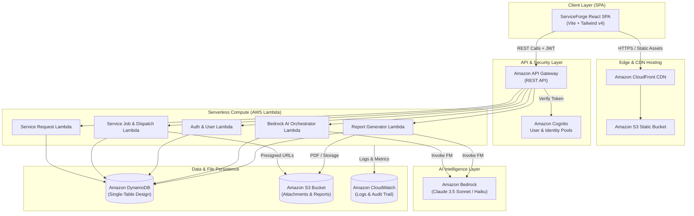
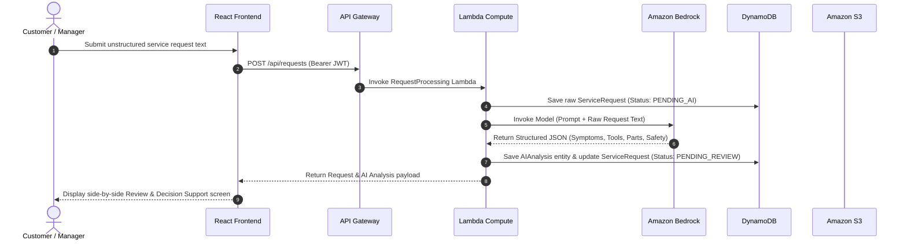
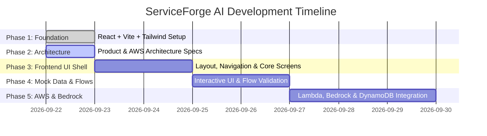

# ServiceForge AI — System Architecture Specification

**Version:** 1.0.0  
**Project:** ServiceForge AI  
**Hackathon:** AWS Builder Center "Zero to Shipped" Hackathon  
**Target Architecture:** Fully Serverless AWS Architecture  

---

## 1. System Architecture Overview

ServiceForge AI leverages a 100% serverless, event-driven, cloud-native architecture built on AWS. The design prioritizes zero idle infrastructure cost, sub-second API latency, enterprise security, and seamless AI orchestrations via Amazon Bedrock.



---

## 2. AWS Component Roles & Responsibility Breakdown

| AWS Service | Architecture Responsibility | Key Configuration / Details |
| :--- | :--- | :--- |
| **Amazon Bedrock** | Core AI reasoning, unstructured entity extraction, safety checklist generation, missing info detection, and customer-facing report generation | Models: Claude 3.5 Sonnet (for complex technical extraction & report writing) / Claude 3 Haiku (for fast triage); Structured JSON output mode. |
| **AWS Lambda** | Event-driven microservices compute executing request processing, AI orchestrations, job state transitions, and presigned URL generation | Node.js 20.x runtime, IAM least-privilege roles, warm start provisioned concurrency for critical API paths. |
| **Amazon API Gateway** | API entry point, route dispatching, request throttling, CORS handling, and JWT authorization verification | REST API type, integrated with Cognito User Pool Authorizer, request validation schemas. |
| **Amazon DynamoDB** | Central single-table NoSQL datastore housing Users, Customers, Assets, Requests, AI Analyses, Jobs, Assignments, Updates, and Reports | Single-Table Design with GSI indexing for $O(1)$ performance, On-Demand Capacity mode, Point-In-Time Recovery (PITR). |
| **Amazon S3** | Object storage for site photos, technician field attachments, equipment PDF manuals, and generated service report documents | Private bucket with AES-256 server-side encryption, CORS rules, and secure short-lived presigned URL access. |
| **Amazon Cognito** | Enterprise User Pool authentication, RBAC claim injection into JWTs, and secure sign-in / password reset flows | Cognito User Pool + Identity Pool, custom claims (`custom:role`, `custom:org_id`), MFA support. |
| **Amazon CloudWatch** | System observability, API log aggregation, Lambda error metrics, and security audit trail logging | Centralized log groups with retention policies, CloudWatch Alarms for 5xx errors and Bedrock throttling. |
| **AWS Amplify / CloudFront** | Global edge distribution, static web hosting, SSL certificate management, and continuous deployment | Global CDN edge caching, custom domain routing, HTTPS enforcement. |

---

## 3. Frontend Architecture & Folder Structure

The frontend is a modular, component-driven Single Page Application (SPA) built with React 18, Vite 6, and Tailwind CSS v4.

```text
src/
├── components/           # Reusable UI Components
│   ├── common/           # Buttons, Badges, Modals, Cards, Input, Table
│   ├── ai/               # AI Analysis Card, Confidence Pill, Safety Warning
│   ├── requests/         # Request Form, Request List, Side-by-Side Review
│   ├── jobs/             # Job Card, Status Pipeline, Assignment Drawer
│   ├── technicians/      # Technician Card, Skill Badge, Availability Bar
│   └── reports/          # Service Report Viewer, PDF Export Preview
├── pages/                # View Pages
│   ├── DashboardPage.jsx
│   ├── ServiceRequestsPage.jsx
│   ├── ServiceJobsPage.jsx
│   ├── TechniciansPage.jsx
│   ├── CustomersPage.jsx
│   ├── AssetsPage.jsx
│   ├── ReportsPage.jsx
│   └── SettingsPage.jsx
├── layouts/              # Screen Layout Shells
│   ├── AppLayout.jsx     # Main Enterprise Sidebar & Top Bar Layout
│   └── AuthLayout.jsx    # Authentication Shell
├── services/             # API & Integration Layers
│   ├── api.js            # Axios / Fetch HTTP Client with Auth Interceptor
│   ├── requestService.js # Service Requests endpoints
│   ├── aiService.js      # Bedrock AI analysis endpoints
│   ├── jobService.js      # Service Jobs endpoints
│   └── s3Service.js      # Presigned URL upload helpers
├── hooks/                # Custom React Hooks
│   ├── useAuth.js        # Auth state & user permissions
│   ├── useRequests.js    # Request query & mutation hook
│   └── useJobs.js        # Job management hook
├── lib/                  # Utilities & Helpers
│   ├── constants.js      # Enums, status codes, priority colors
│   ├── formatters.js     # Date, currency, string formatters
│   └── validators.js     # Input validation schema
├── assets/               # Branding, SVG icons, static images
├── App.jsx               # Application Router & Global Context Providers
├── main.jsx              # React Entry Point
└── index.css             # Tailwind CSS v4 Global Base Styles
```

---

## 4. End-to-End Execution Sequence



---

## 5. Implementation Phases & Roadmap


