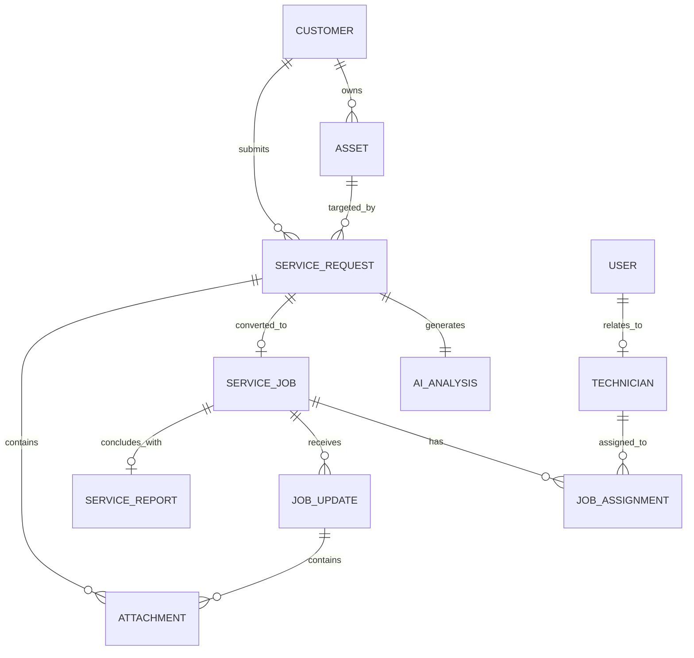

# ServiceForge AI — Data Model Specification

**Version:** 1.0.0  
**Project:** ServiceForge AI  
**Target Datastore:** Amazon DynamoDB (Single-Table Design)  

---

## 1. Entity Relationship Diagram (ERD)

---

## 2. Core Entities & Field Schema Definitions

### 2.1 `User`
Represents an authenticated user within the system.
- `id` (UUID): Unique User Identifier
- `email` (String, Unique): User primary email address
- `fullName` (String): Display name
- `role` (Enum): `SERVICE_MANAGER` | `DISPATCHER` | `TECHNICIAN` | `CUSTOMER`
- `orgId` (UUID): Organization / Customer ID
- `phone` (String): Contact phone number
- `createdAt` (ISO8601): User creation timestamp
- `status` (Enum): `ACTIVE` | `INACTIVE` | `SUSPENDED`

### 2.2 `Customer`
Represents a B2B enterprise customer account.
- `id` (UUID): Unique Customer Account ID
- `companyName` (String): Business organization name
- `contactName` (String): Primary contact person name
- `contactEmail` (String): Primary contact email
- `contactPhone` (String): Phone number
- `address` (Object): Street, City, State, Zip, Country
- `slaTier` (Enum): `PLATINUM_4H` | `GOLD_8H` | `SILVER_24H` | `STANDARD`
- `createdAt` (ISO8601): Account creation timestamp

### 2.3 `Asset` (Equipment)
Represents industrial machinery or equipment serviced by the system.
- `id` (UUID): Unique Asset ID
- `customerId` (UUID, Foreign Key): Owning Customer
- `name` (String): Asset name (e.g., "Industrial Air Compressor")
- `modelNumber` (String): Manufacturer model designation
- `serialNumber` (String, Unique): Equipment serial number
- `category` (Enum): `COMPRESSOR` | `HVAC` | `GENERATOR` | `PUMP` | `BOILER` | `CONVEYOR`
- `location` (String): Physical installation site / room (e.g., "Building B, Floor 2, Bay 4")
- `installDate` (String): Installation date
- `status` (Enum): `OPERATIONAL` | `DEGRADED` | `OFFLINE` | `MAINTENANCE`

### 2.4 `ServiceRequest`
Represents raw customer service requests before or after AI analysis.
- `id` (UUID): Unique Service Request ID
- `ticketNumber` (String, Human-readable): e.g. `REQ-2026-0841`
- `customerId` (UUID, Foreign Key): Submitting Customer
- `assetId` (UUID, Foreign Key, Optional): Associated Asset
- `submittedByUserId` (UUID, Foreign Key): Requester User ID
- `description` (Text): Final user-reviewed/approved problem description
- `descriptionSource` (Enum): `typed` | `voice` | `edited_voice` (Tracks origin & audit history)
- `attachments` (Array of UUIDs): List of associated `Attachment` entity IDs
- `channel` (Enum): `WEB_PORTAL` | `EMAIL` | `VOICE_TRANSCRIPT` | `MOBILE_APP`
- `status` (Enum): `SUBMITTED` | `AI_ANALYZING` | `PENDING_REVIEW` | `APPROVED` | `REJECTED` | `CANCELLED`
- `createdAt` (ISO8601): Submission timestamp
- `updatedAt` (ISO8601): Modification timestamp

### 2.5 `Attachment` (Multimodal Evidence)
Represents uploaded images, diagnostic PDFs, and evidence files linked to service requests or field updates.
- `attachmentId` (UUID): Unique Attachment Identifier
- `organizationId` (UUID): Multi-tenant Organization Boundary ID
- `serviceRequestId` (UUID, Foreign Key, Optional): Associated Service Request ID
- `fileName` (String): Sanitized original file name
- `contentType` (String): Validated MIME type (`image/jpeg`, `application/pdf`, etc.)
- `sizeBytes` (Integer): File size in bytes (Max 15 MB)
- `type` (Enum): `image` | `document`
- `s3Bucket` (String): Target private S3 bucket name
- `s3Key` (String): S3 object path (`attachments/orgs/<orgId>/...`)
- `uploadedByUserId` (UUID, Foreign Key): Submitting User ID
- `createdAt` (ISO8601): Upload creation timestamp

### 2.6 `AIAnalysis`
Stores structured decision support outputs generated by Amazon Bedrock.
- `id` (UUID): Unique Analysis ID
- `requestId` (UUID, Foreign Key): Associated Service Request
- `summary` (String): Executive summary of reported issue
- `detectedAssetCategory` (String): Identified asset class
- `symptoms` (Array of Strings): Extracted symptom list
- `recommendedPriority` (Enum): `CRITICAL` | `HIGH` | `MEDIUM` | `LOW`
- `recommendedSkillProfile` (String): Required technician skill tier
- `suggestedInspectionSteps` (Array of Objects): `[{ stepNumber: Int, instruction: String, critical: Boolean }]`
- `suggestedTools` (Array of Strings): Required equipment & tools list
- `suggestedParts` (Array of Objects): `[{ partName: String, partNumber: String, optional: Boolean }]`
- `safetyConsiderations` (Array of Strings): Safety warnings & LOTO procedures
- `missingInformation` (Array of Strings): Unclear parameters requiring human check
- `confidenceScore` (Float): Overall AI confidence score (0.0 to 1.0)
- `modelUsed` (String): Bedrock model ID (e.g. `anthropic.claude-3-5-sonnet-20241022-v2:0`)
- `createdAt` (ISO8601): Timestamp of AI execution

### 2.7 `ServiceJob`
Represents an approved, executable work order created from a Service Request.
- `id` (UUID): Unique Service Job ID
- `jobIdNumber` (String, Human-readable): e.g. `JOB-2026-0412`
- `requestId` (UUID, Foreign Key): Originating Service Request ID
- `customerId` (UUID, Foreign Key): Customer ID
- `assetId` (UUID, Foreign Key): Target Asset ID
- `title` (String): Concise job title
- `priority` (Enum): `CRITICAL` | `HIGH` | `MEDIUM` | `LOW`
- `status` (Enum): `UNASSIGNED` | `ASSIGNED` | `EN_ROUTE` | `IN_PROGRESS` | `ON_HOLD` | `COMPLETED` | `CANCELLED`
- `confirmedInspectionChecklist` (Array of Objects): Verified checklist steps
- `requiredTools` (Array of Strings): Confirmed tools
- `requiredParts` (Array of Objects): Confirmed parts list
- `safetyGuidelines` (Array of Strings): Mandatory safety requirements
- `estimatedDurationMinutes` (Integer): Target service duration
- `targetSlaDeadline` (ISO8601): SLA completion target timestamp
- `createdByUserId` (UUID, Foreign Key): Service Manager ID who approved job
- `createdAt` (ISO8601): Creation timestamp

### 2.8 `Technician`
Represents field service personnel.
- `id` (UUID): Unique Technician ID
- `userId` (UUID, Foreign Key): Associated User ID
- `employeeId` (String): Corporate employee identifier
- `skills` (Array of Strings): Certified technical skills (e.g., `["PNEUMATICS_L3", "LOTO_CERTIFIED", "HVAC_SENIOR"]`)
- `currentStatus` (Enum): `AVAILABLE` | `ON_JOB` | `OFF_DUTY` | `TRAVELING`
- `currentLocation` (Object): `{ latitude: Float, longitude: Float, lastUpdated: ISO8601 }`
- `activeJobCount` (Integer): Current active assigned workload count

### 2.9 `JobAssignment`
Tracks technician assignments to service jobs.
- `id` (UUID): Unique Assignment ID
- `jobId` (UUID, Foreign Key): Service Job ID
- `technicianId` (UUID, Foreign Key): Technician ID
- `assignedByUserId` (UUID, Foreign Key): Dispatcher ID
- `scheduledStartTime` (ISO8601): Scheduled dispatch start time
- `scheduledEndTime` (ISO8601): Estimated completion time
- `assignedAt` (ISO8601): Assignment creation timestamp
- `status` (Enum): `PENDING_ACCEPTANCE` | `ACCEPTED` | `REJECTED` | `COMPLETED`

### 2.10 `JobUpdate`
Real-time field updates posted by technicians during service execution.
- `id` (UUID): Unique Update ID
- `jobId` (UUID, Foreign Key): Service Job ID
- `technicianId` (UUID, Foreign Key): Technician ID
- `updateType` (Enum): `CHECKLIST_STEP` | `NOTE` | `PART_USED` | `PHOTO_LOG` | `STATUS_CHANGE`
- `stepNumberCompleted` (Integer, Optional): Completed checklist item index
- `notes` (Text): Field observations
- `partsUsed` (Array of Objects): `[{ partName: String, quantity: Int }]`
- `timestamp` (ISO8601): Update timestamp

### 2.11 `ServiceReport`
Final customer-facing summary generated upon job completion.
- `id` (UUID): Unique Report ID
- `reportNumber` (String): e.g. `RPT-2026-0412`
- `jobId` (UUID, Foreign Key): Service Job ID
- `executiveSummary` (Text): AI-generated clean summary of resolution
- `workPerformed` (Text): Detailed log of actions taken
- `partsReplaced` (Array of Objects): Final parts & materials summary
- `technicianSignOff` (Object): `{ technicianName: String, signedAt: ISO8601 }`
- `customerSignOff` (Object): `{ customerName: String, signatureUrl: String, signedAt: ISO8601 }`
- `pdfStorageUrl` (String): S3 URL to generated PDF report
- `generatedAt` (ISO8601): Creation timestamp

---

## 3. DynamoDB Single-Table Design Strategy

All entities reside within a single DynamoDB table named `ServiceForge`:

| Entity | Partition Key (PK) | Sort Key (SK) | GSI1-PK | GSI1-SK |
| :--- | :--- | :--- | :--- | :--- |
| **Customer** | `ORG#<OrgId>` | `CUST#<CustomerId>` | `ORG#<OrgId>#CUSTOMERS` | `CUST#<CustomerId>` |
| **Asset** | `ORG#<OrgId>` | `ASSET#<AssetId>` | `ORG#<OrgId>#CUST#<CustomerId>` | `ASSET#<AssetId>` |
| **ServiceRequest** | `ORG#<OrgId>` | `REQ#<RequestId>` | `ORG#<OrgId>#STATUS#<Status>` | `CREATED#<Timestamp>` |
| **Attachment** | `ORG#<OrgId>` | `ATTACHMENT#<ReqId>#<AttId>` | `ORG#<OrgId>#ATTACHMENT` | `REQ#<ReqId>#<AttId>` |
| **AIAnalysis** | `ORG#<OrgId>` | `AI_ANALYSIS#<RequestId>` | `ORG#<OrgId>#AI_STATUS#<Status>` | `CREATED#<Timestamp>` |
| **ServiceJob** | `ORG#<OrgId>` | `JOB#<JobId>` | `ORG#<OrgId>#JOB_STATUS#<Status>` | `SLA#<Deadline>` |
| **JobAssignment** | `ORG#<OrgId>` | `ASSIGN#<JobId>#<TechId>` | `ORG#<OrgId>#TECH#<TechId>` | `SCHEDULED#<Time>` |
| **JobUpdate** | `ORG#<OrgId>` | `UPDATE#<JobId>#<Timestamp>` | `ORG#<OrgId>#JOB_UPDATES` | `JOB#<JobId>#<Timestamp>` |
| **ServiceReport** | `ORG#<OrgId>` | `REPORT#<JobId>` | `ORG#<OrgId>#REPORTS` | `REPORT#<ReportId>` |

