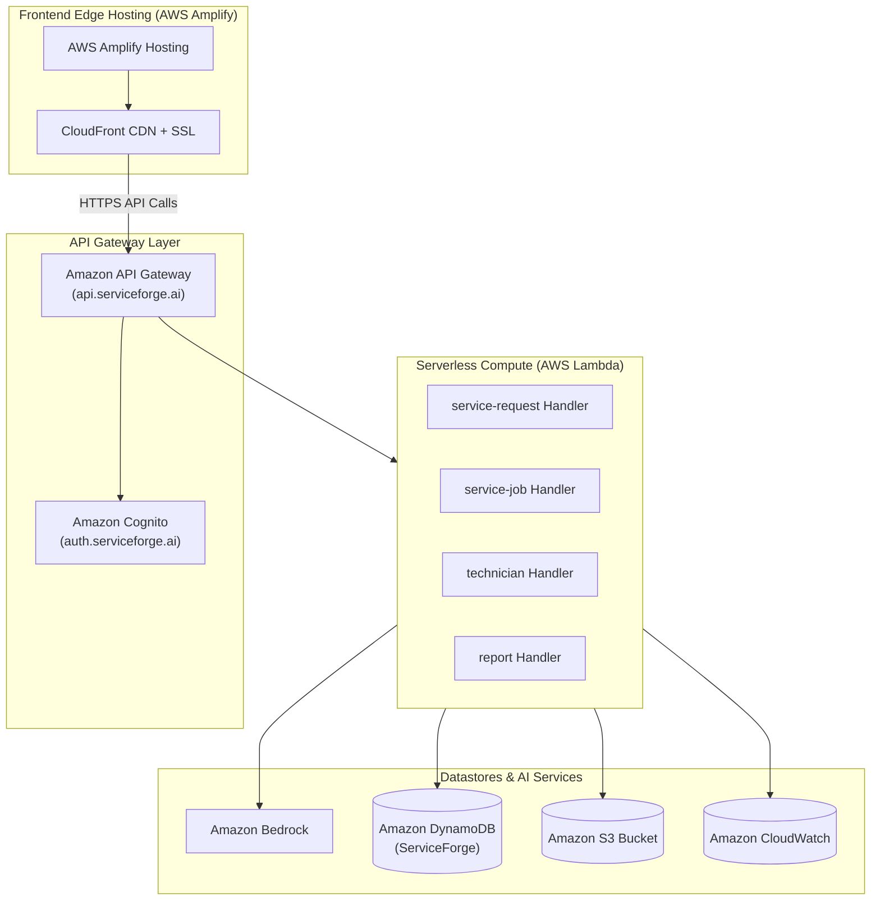

# ServiceForge AI — Deployment & Infrastructure-as-Code Specification

**Version:** 1.0.0  
**Project:** ServiceForge AI  
**Infrastructure-as-Code (IaC):** AWS Serverless Application Model (AWS SAM)  
**Target Region:** `ap-south-1` (Mumbai)  

---

## 1. Production Architecture Overview



---

## 2. Infrastructure-as-Code (AWS SAM `template.yaml`)

```yaml
AWSTemplateFormatVersion: '2010-09-09'
Transform: AWS::Serverless-2016-10-31
Description: ServiceForge AI — Serverless Infrastructure Specification

Globals:
  Function:
    Timeout: 30
    Runtime: python3.12
    MemorySize: 512
    Environment:
      Variables:
        AWS_REGION: !Ref AWS::Region
        DYNAMODB_TABLE_NAME: !Ref ServiceForgeTable
        BEDROCK_MODEL_ID: 'anthropic.claude-3-5-sonnet-20241022-v2:0'

Resources:
  # DynamoDB Single-Table Datastore
  ServiceForgeTable:
    Type: AWS::DynamoDB::Table
    Properties:
      TableName: ServiceForge
      BillingMode: PAY_PER_REQUEST
      AttributeDefinitions:
        - AttributeName: PK
          AttributeType: S
        - AttributeName: SK
          AttributeType: S
        - AttributeName: GSI1PK
          AttributeType: S
        - AttributeName: GSI1SK
          AttributeType: S
        - AttributeName: GSI2PK
          AttributeType: S
        - AttributeName: GSI2SK
          AttributeType: S
      KeySchema:
        - AttributeName: PK
          KeyType: HASH
        - AttributeName: SK
          KeyType: RANGE
      GlobalSecondaryIndexes:
        - IndexName: GSI1
          KeySchema:
            - AttributeName: GSI1PK
              KeyType: HASH
            - AttributeName: GSI1SK
              KeyType: RANGE
          Projection:
            ProjectionType: ALL
        - IndexName: GSI2
          KeySchema:
            - AttributeName: GSI2PK
              KeyType: HASH
            - AttributeName: GSI2SK
              KeyType: RANGE
          Projection:
            ProjectionType: ALL

  # S3 Bucket for Attachments & PDF Reports
  ServiceForgeAttachmentsBucket:
    Type: AWS::S3::Bucket
    Properties:
      BucketName: !Sub 'serviceforge-ai-attachments-${AWS::AccountId}'
      PublicAccessBlockConfiguration:
        BlockPublicAcls: true
        BlockPublicPolicy: true
        IgnorePublicAcls: true
        RestrictPublicBuckets: true
      BucketEncryption:
        ServerSideEncryptionConfiguration:
          - ServerSideEncryptionByDefault:
              SSEAlgorithm: AES256

  # API Gateway REST API
  ServiceForgeApi:
    Type: AWS::Serverless::Api
    Properties:
      StageName: prod
      Cors:
        AllowMethods: "'GET,POST,PATCH,OPTIONS'"
        AllowHeaders: "'Content-Type,Authorization'"
        AllowOrigin: "'*'"
```

---

## 3. Environment Strategy

| Environment | Purpose | Domain URL | AWS Region |
| :--- | :--- | :--- | :--- |
| **Development (`dev`)** | Local dev & feature branch validation | `http://localhost:5173` | `ap-south-1` |
| **Staging (`staging`)** | Pre-production integration & QA | `https://staging.serviceforge.ai` | `ap-south-1` |
| **Production (`prod`)** | Live B2B SaaS application | `https://app.serviceforge.ai` | `ap-south-1` |

---

## 4. Build & Deployment Steps

### 4.1 Frontend (AWS Amplify Hosting)
1. Triggered on `git push` to `main` branch.
2. Build Command: `cd Frontend && npm install && npm run build`.
3. Output Directory: `Frontend/dist`.
4. Deployed to AWS Amplify edge CDN with automatic SSL certificate provisioned.

### 4.2 Backend (AWS SAM CLI)
1. Build Lambda packages: `sam build --template Infrastructure/template.yaml`.
2. Deploy to AWS: `sam deploy --stack-name serviceforge-prod --guided`.

---

## 5. Required AWS Services Breakdown for Multimodal System

The ServiceForge AI multimodal intake & field operations architecture relies on the following core AWS services:

| AWS Service | Deployment Role | Target Configuration |
| :--- | :--- | :--- |
| **Amazon S3** | Private evidence photo, audio & report document storage | Encryption enabled (`AES256`), Block Public Access (`true`), Presigned URLs (15-min expiration). |
| **Amazon Transcribe** | Speech-to-Text conversion for voice note inputs | Managed speech recognition service parsing audio streams/recordings into text. |
| **Amazon Bedrock** | Multimodal reasoning & structured decision support | Model: `anthropic.claude-3-5-sonnet-20241022-v2:0` (Text + Vision OCR & document reasoning). |
| **AWS Lambda** | Event-driven microservices compute | Runtime: Python 3.12, least-privilege IAM execution roles. |
| **Amazon API Gateway** | Serverless REST API stage & authorization | REST API stage (`prod`), Cognito User Pool Authorizer, CORS headers. |
| **Amazon DynamoDB** | Single-table datastore | Table: `ServiceForge`, On-demand (`PAY_PER_REQUEST`), PITR enabled. |

> **DESTRUCTIVE ACTION NOTICE:** Infrastructure specification only. No SAM deployment (`sam deploy`) or cloud resource creation commands will be executed until explicitly requested by the user.

---

## 6. Rollback Strategy & Monitoring

- **Amplify Rollback:** Instant one-click rollback to previous atomic frontend build deployment.
- **SAM Lambda Rollback:** Uses AWS CloudFormation stack rollback if deployment or post-deploy health check fails.
- **CloudWatch Alarms:** Alarms configured for > 1% API Gateway 5xx errors or Lambda unhandled exception rate.
