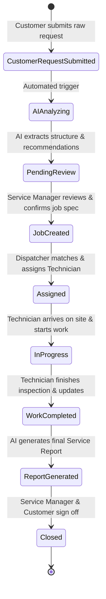

# ServiceForge AI — Product Specification

**Version:** 1.0.0  
**Project:** ServiceForge AI  
**Hackathon:** AWS Builder Center "Zero to Shipped" Hackathon  
**Track:** Startup Lane (Commercial Potential)  
**Status:** Approved Product Architecture Specification  

---

## 1. Executive Summary & Vision

### 1.1 Product Vision
**ServiceForge AI** is an enterprise-grade, AI-powered service operations platform designed for B2B industrial, HVAC, facilities management, and field service organizations. It bridges the critical gap between customer issue reporting and field service execution by transforming unstructured customer requests (emails, voice transcripts, forms, message logs) into structured, ready-to-execute service jobs with automated decision support.

### 1.2 Problem Statement
In traditional B2B service operations, customer request triage is manual, slow, and error-prone:
- **Unstructured & Vague Requests:** Customers report issues like *"Our industrial compressor starts normally but becomes very noisy and shuts down after about ten minutes"* without knowing specific part numbers, technical terms, or urgency levels.
- **Dispatch Overhead:** Service managers spend 20–40 minutes per ticket researching equipment manuals, cross-referencing technician skills, determining required parts, and drafting safety guidelines.
- **First-Time Fix Failure:** Technicians frequently arrive on-site with missing tools, improper replacement parts, or insufficient safety gear due to poor initial job preparation.
- **Delayed Closeout Reports:** Field notes are handwritten or typed loosely, delaying customer sign-off and invoicing by days or weeks.

### 1.3 Value Proposition
- **70% Faster Triage to Dispatch:** AI instantly extracts equipment details, symptoms, urgency, required skill profiles, tools, parts, and safety protocols.
- **Higher First-Time Fix Rates:** Technicians receive structured inspection checklists, suggested tools, and potential replacement parts before leaving for the site.
- **Decision Support Safety Net:** AI recommendations serve purely as decision support—never replacing human engineering judgment—ensuring full human-in-the-loop control.
- **Automated Service Reports:** One-click AI generation of polished, client-facing service completion reports directly from technician field updates.

---

## 2. Core Workflow & Lifecycle

The lifecycle of a service job in ServiceForge AI follows an 8-stage state machine:

### Stage Details:
1. **Customer Request Submission:** Raw text, voice note transcript, or web portal submission.
2. **AI Understanding & Extraction:** Amazon Bedrock parses unstructured text into structured diagnostic metadata.
3. **Job Preparation & Manager Review:** Service Manager inspects AI recommendations, modifies missing details, and confirms the job specification.
4. **Technician Assignment:** Automated matching based on skill rating, availability, geographic proximity, and certifications.
5. **Service Execution:** Technician views job package on desktop/mobile device containing safety rules, tools, and step-by-step inspection checklist.
6. **Technician Field Updates:** Technician logs real-time progress, completed items, photos, and replacement parts used.
7. **AI Service Report Generation:** Amazon Bedrock compiles raw technician notes and job specs into a professional B2B Service Completion Report.
8. **Job Closure:** Final review, customer sign-off, and archival into asset maintenance history.

---

## 3. User Roles & Authorization Matrix

ServiceForge AI supports four primary user personas with strict Role-Based Access Control (RBAC):

| Persona / Role | Core Responsibilities | Key Capabilities & Permissions | Primary Device Focus |
| :--- | :--- | :--- | :--- |
| **Service Manager** | Operations oversight, AI recommendation review, job approval, platform settings, client management | Full access to all modules, request conversion approval, report sign-off, asset registry management, platform analytics | Desktop (Primary) |
| **Dispatcher / Ops Manager** | Technician scheduling, route optimization, real-time job tracking, resource allocation | View/edit jobs, assign/reassign technicians, track live dispatch status, override priority levels | Desktop / Tablet |
| **Field Technician** | On-site execution, safety compliance, step-by-step checklist execution, field photo logging, work notes | View assigned jobs, update job status, log completed steps, attach photos/notes, request additional parts | Mobile / Tablet (Primary) |
| **Customer / Requester** | Service request creation, asset tracking, job progress monitoring, final report review & sign-off | Submit new service requests, view request status, view equipment service history, download signed service reports | Desktop / Mobile |

---

## 4. AI Decision Support Philosophy

To ensure absolute safety, regulatory compliance, and operational trust in industrial and commercial environments, ServiceForge AI operates under a strict **Decision Support Model**:

### 4.1 Core AI Principles
1. **Human-in-the-Loop Validation:** The AI does *not* auto-create confirmed work orders or auto-dispatch technicians without human review. All AI outputs are presented as *suggestions* for human confirmation.
2. **Explicit Data Separation:** The UI strictly separates **User Reported Information** (raw customer inputs) from **AI-Generated Recommendations** (suggested tools, parts, priority, safety).
3. **Transparent Confidence & Caution:**
   - High-confidence extractions (e.g., explicit equipment serial numbers) are highlighted clearly.
   - Ambiguous or missing details trigger an explicit *"Missing Information / Clarification Required"* section in the UI.
4. **Safety-First Framing:** Safety considerations (e.g., Lockout/Tagout, pressure vessel relief, high-voltage precautions) are prominently badged to guarantee technician awareness before site arrival.
5. **Zero Unsupported Diagnostic Claims:** The AI frames potential root causes as *"Possible Causes for Inspection"* rather than definitive diagnostic truths.

---

## 5. Example Processing Flow

### Input Scenario:
> *"Our industrial compressor (Model AC-4500, Unit 3) starts normally but becomes very noisy and shuts down after about ten minutes."*

### AI Processing & Structured Output:
- **Detected Asset:** Industrial Compressor (Model AC-4500, Unit 3)
- **Reported Symptoms:** Heavy noise during operation, thermal/pressure shutdown after ~10 minutes
- **Calculated Urgency / Priority:** High (Impacting production line uptime)
- **Recommended Skill Profile:** Senior HVAC/Pneumatics Technician (L3 Certification)
- **Suggested Inspection Steps:**
  1. Perform Lockout/Tagout (LOTO) on main power supply.
  2. Inspect cooling fan and drive belt tension.
  3. Check oil levels and thermal cutoff sensor wiring.
  4. Measure operating pressure differential prior to thermal cutout.
- **Suggested Tools:** Multimeter, Infrared Thermal Imager, Belt Tension Gauge, Torque Wrench set.
- **Possible Parts / Materials:** Thermal Overload Relay, Drive Belt Replacement (Part #DB-4500), Compressor Oil ISO 68.
- **Safety Considerations:** High-voltage electrical hazard; thermal burn risk on compressor head; pressurized gas release risk.
- **Missing Information / Questions for Requester:** Has the unit logged any specific error codes on the digital control panel before shutting down?

---

## 6. Commercial Potential & Hackathon Strategy

### 6.1 Hackathon Category Alignment
- **Category:** Commercial Potential | **Lane:** Startup
- **Target Market:** B2B Field Service Management (FSM) market ($4.5B TAM, growing at 16.5% CAGR).
- **Monetization Model:** Tiered SaaS subscription per active technician ($49–$119/tech/month) + AWS Bedrock token-based usage tier.
- **Key Differentiator:** Zero-configuration AI setup that works out-of-the-box on raw customer inputs without complex training pipelines.
