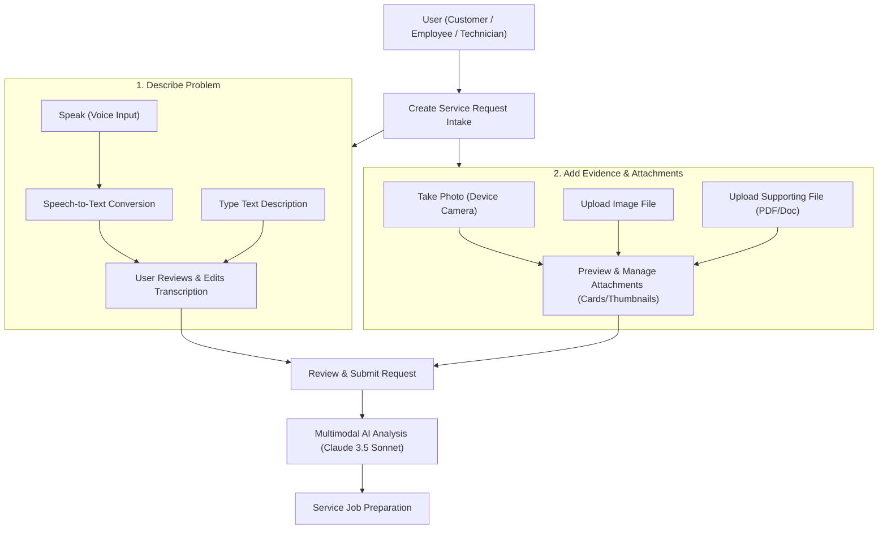
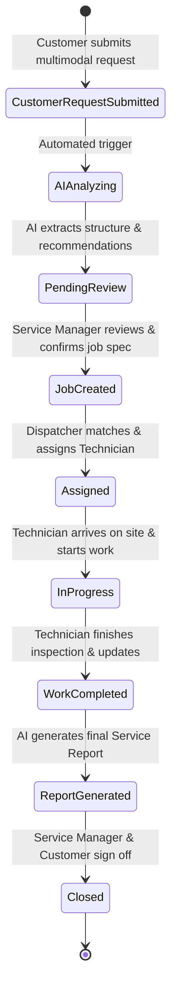

# ServiceForge AI — Product Specification

**Version:** 1.0.0  
**Project:** ServiceForge AI  
**Hackathon:** AWS Builder Center "Zero to Shipped" Hackathon  
**Track:** Startup Lane (Commercial Potential)  
**Status:** Approved Product Architecture Specification  

---

## 1. Executive Summary & Vision

### 1.1 Product Vision
**ServiceForge AI** is an enterprise-grade, AI-powered service operations platform designed for B2B industrial, HVAC, facilities management, and field service organizations. It bridges the critical gap between customer issue reporting and field service execution by transforming unstructured customer requests (emails, voice transcripts, forms, message logs) into structured, ready-to-execute service jobs with automated decision support.

### 1.2 Problem Statement
In traditional B2B service operations, customer request triage is manual, slow, and error-prone:
- **Unstructured & Vague Requests:** Customers report issues like *"Our industrial compressor starts normally but becomes very noisy and shuts down after about ten minutes"* without knowing specific part numbers, technical terms, or urgency levels.
- **Dispatch Overhead:** Service managers spend 20–40 minutes per ticket researching equipment manuals, cross-referencing technician skills, determining required parts, and drafting safety guidelines.
- **First-Time Fix Failure:** Technicians frequently arrive on-site with missing tools, improper replacement parts, or insufficient safety gear due to poor initial job preparation.
- **Delayed Closeout Reports:** Field notes are handwritten or typed loosely, delaying customer sign-off and invoicing by days or weeks.

### 1.3 Value Proposition
- **70% Faster Triage to Dispatch:** AI instantly extracts equipment details, symptoms, urgency, required skill profiles, tools, parts, and safety protocols.
- **Higher First-Time Fix Rates:** Technicians receive structured inspection checklists, suggested tools, and potential replacement parts before leaving for the site.
- **Decision Support Safety Net:** AI recommendations serve purely as decision support—never replacing human engineering judgment—ensuring full human-in-the-loop control.
- **Automated Service Reports:** One-click AI generation of polished, client-facing service completion reports directly from technician field updates.

---

## 2. Multimodal Intake Workflow & Core Lifecycle

### 2.1 Multimodal Service Request Intake Workflow
ServiceForge AI empowers requesters (customers, employees, field technicians) to capture problem details naturally through multiple input modes—eliminating reliance on pure text typing:



*Note: Voice input is an alternative input method, not a replacement for typing. Users may choose typing, voice dictation, or a combination of both.*

### 2.2 Lifecycle State Machine
The lifecycle of a service job in ServiceForge AI follows an 8-stage state machine:



### Stage Details:
1. **Multimodal Customer Request Submission:** User describes problem (typed, voice dictation, or edited voice) and attaches evidence (photos, documents).
2. **Multimodal AI Understanding & Extraction:** Amazon Bedrock (Claude 3.5 Sonnet) parses text description, attached images (equipment nameplates, damage photos), and supporting documents into structured diagnostic metadata.
3. **Job Preparation & Manager Review:** Service Manager inspects AI recommendations side-by-side with submitted evidence, modifies details, and confirms job specification.
4. **Technician Assignment:** Automated matching based on skill rating, availability, geographic proximity, and certifications.
5. **Service Execution:** Technician views job package on mobile/desktop containing safety rules, tools, and step-by-step inspection checklist.
6. **Technician Field Updates:** Technician logs real-time progress, completed items, field photos, and replacement parts used.
7. **AI Service Report Generation:** Amazon Bedrock compiles raw technician notes, field photos, and job specs into a professional B2B Service Completion Report.
8. **Job Closure:** Final review, customer sign-off, and archival into asset maintenance history.

---

## 3. Voice Input & Transcription Specification

### 3.1 User Experience Flow
1. User selects **"🎙 Speak"** mode on the Create Service Request screen.
2. Application requests browser/device microphone permission.
3. User records their spoken explanation (live audio waveform visualizer active).
4. User clicks **"Stop"** or recording reaches maximum 120-second timeout.
5. Audio is processed via Speech-to-Text conversion.
6. Transcription is displayed clearly to the user in an editable preview box.
7. User reviews the transcription and can edit text inline, record again, or clear.
8. User continues to evidence submission **only after reviewing and approving** the text description.

> **CRITICAL MANDATE:** The system must **NEVER** silently submit an unreviewed transcription as the final problem description. Human review and explicit approval are mandatory before submission.

### 3.2 Voice Input State Machine
The voice recording component operates across 6 explicit states:

| Voice State | Description | User Interface Actions Available |
| :--- | :--- | :--- |
| `IDLE` | Microphone ready, initial state | `Start Speaking` |
| `RECORDING` | Live microphone capture active | `Stop Recording`, `Cancel` |
| `PROCESSING` | Audio processing & STT conversion in progress | Disabled (Loading indicator displayed) |
| `TRANSCRIBED` | Raw STT text rendered in preview box | `Edit Text`, `Record Again`, `Clear` |
| `EDITING` | User actively modifying transcription text | `Save Edits`, `Record Again`, `Clear` |
| `ERROR` | Recording or STT failure encountered | `Retry`, `Switch to Typed Input` |

### 3.3 Voice Error Handling & Fallbacks
- **Microphone Permission Denied:** Display friendly error banner explaining microphone access requirements with explicit fallback button to **"Switch to Typed Input"**.
- **Recording Failure / Audio Hardware Error:** Show error notice, reset state to `IDLE`, allow re-try.
- **Transcription Failure / STT Error:** Preserve raw audio session temporarily, show error message: *"Transcription unavailable. Please type your description or try recording again."*
- **Unsupported Audio Format:** Prompt user to record via standard browser WebAudio API.
- **Network Failure:** Handle offline state gracefully, preserving recorded audio in browser memory for retry when connection restores.
- **Empty / Inaudible Transcription:** Prompt user: *"No speech detected. Please speak clearly or switch to typed input."*

### 3.4 Description Source Tracking (`descriptionSource`)
To maintain strict auditability of user-submitted text, every Service Request tracks the origin of its description using `descriptionSource`:

| `descriptionSource` Value | Meaning & Audit Rules |
| :--- | :--- |
| `typed` | User directly typed the description into the text field. |
| `voice` | Description originated from speech-to-text conversion and was approved without edits. |
| `edited_voice` | Description originated from speech-to-text conversion and was subsequently edited/modified by the user before approval. |

*Rule:* The final user-approved text string is stored as the canonical `description` for the request. Raw audio is not retained permanently unless explicitly configured under customer data retention policies.

### 3.5 Voice & Transcription Metadata
```json
{
  "transcriptionId": "stt-9988-a1b2",
  "source": "voice",
  "status": "COMPLETED",
  "language": "en-US",
  "durationSeconds": 18.5,
  "createdAt": "2026-09-23T11:45:00Z",
  "updatedAt": "2026-09-23T11:45:05Z"
}
```

---

## 4. Evidence Capture & Attachment Specifications

### 4.1 Image Capture & File Upload Experience
Users can attach multiple evidence files to complement their problem description:
- **Take Photo (Mobile):** Native camera integration (`capture="environment"`) allowing on-site technicians/customers to snap immediate photos of equipment nameplates, error codes, leaking valves, or damaged components.
- **Upload Image (Desktop/Mobile):** Select existing image files from local gallery or filesystem.
- **Upload Supporting Files (Desktop/Mobile):** Attach equipment manuals, diagnostic logs, PDF reports, or maintenance histories.
- **Interactive Preview & Management:** Uploaded files render immediately as interactive preview cards showing thumbnail, filename, file type, file size, and a `Remove (✕)` action.

### 4.2 File Validation Rules & Safety Constraints
To prevent abuse, malware distribution, and system degradation, all file uploads enforce strict validation rules:

| Constraint | Limit / Rule | Justification |
| :--- | :--- | :--- |
| **Maximum File Size** | 15 MB per file | Prevents network timeouts & S3 storage abuse |
| **Maximum Attachments** | 10 files per Service Request | Ensures high-quality, focused evidence collection |
| **Allowed Image MIME Types** | `image/jpeg`, `image/png`, `image/webp`, `image/heic` | Supported by browser preview & Bedrock vision |
| **Allowed Document MIME Types** | `application/pdf`, `text/plain`, `text/csv` | Diagnostic manuals, logs, and spreadsheets |
| **Prohibited Extensions** | `.exe`, `.bat`, `.cmd`, `.sh`, `.js`, `.vbs`, `.zip`, `.tar` | Strict rejection of executable binaries & archives |
| **Filename Safety** | Sanitized to alphanumeric, hyphen, underscore, and dot | Prevents path traversal (`../`) and shell injection |

---

## 5. User Roles & Authorization Matrix

ServiceForge AI supports four primary user personas with strict Role-Based Access Control (RBAC):

| Persona / Role | Core Responsibilities | Key Capabilities & Permissions | Primary Device Focus |
| :--- | :--- | :--- | :--- |
| **Service Manager** | Operations oversight, AI recommendation review, job approval, platform settings, client management | Full access to all modules, request conversion approval, report sign-off, asset registry management, platform analytics | Desktop (Primary) |
| **Dispatcher / Ops Manager** | Technician scheduling, route optimization, real-time job tracking, resource allocation | View/edit jobs, assign/reassign technicians, track live dispatch status, override priority levels | Desktop / Tablet |
| **Field Technician** | On-site execution, safety compliance, step-by-step checklist execution, field photo logging, work notes | View assigned jobs, update job status, log completed steps, attach photos/notes, request additional parts | Mobile / Tablet (Primary) |
| **Customer / Requester** | Service request creation, asset tracking, job progress monitoring, final report review & sign-off | Submit new service requests (typed/voice + evidence), view request status, view equipment service history, download signed service reports | Desktop / Mobile |

---

## 6. AI Decision Support Philosophy

To ensure absolute safety, regulatory compliance, and operational trust in industrial and commercial environments, ServiceForge AI operates under a strict **Decision Support Model**:

### 6.1 Core AI Principles
1. **Human-in-the-Loop Validation:** The AI does *not* auto-create confirmed work orders or auto-dispatch technicians without human review. All AI outputs are presented as *suggestions* for human confirmation.
2. **Explicit Data Separation:** The UI strictly separates **User Reported Information** (raw customer inputs, voice transcripts, uploaded evidence) from **AI-Generated Recommendations** (suggested tools, parts, priority, safety).
3. **Multimodal Evidence Reasoning:** Amazon Bedrock (Claude 3.5 Sonnet) analyzes both the user text description and attached evidence images (e.g. OCR extraction from equipment nameplates, visual damage assessment).
4. **Transparent Confidence & Caution:**
   - High-confidence extractions (e.g., explicit equipment serial numbers from photos) are highlighted clearly.
   - Ambiguous or missing details trigger an explicit *"Missing Information / Clarification Required"* section in the UI.
5. **Safety-First Framing:** Safety considerations (e.g., Lockout/Tagout, pressure vessel relief, high-voltage precautions) are prominently badged to guarantee technician awareness before site arrival.
6. **Zero Unsupported Diagnostic Claims:** The AI frames potential root causes as *"Possible Causes for Inspection"* rather than definitive diagnostic truths.

---

## 7. Example Processing Flow

### Input Scenario:
- **Input Mode:** Voice Dictation (`descriptionSource: "edited_voice"`)
- **Transcribed & Approved Description:** *"Our industrial air compressor starts normally but develops heavy knocking noise after 10 minutes and shuts down on thermal overload."*
- **Attached Evidence:**
  1. `nameplate.jpg` (Photo of compressor serial/model plate)
  2. `error_log.pdf` (Control panel thermal shutdown log)

### Multimodal AI Processing & Structured Output:
- **Detected Asset:** Industrial Air Compressor (Model AC-4500, Serial #SN-2024-88412 extracted via OCR from `nameplate.jpg`)
- **Reported Symptoms:** Heavy operational noise, thermal cutoff shutdown after ~10 minutes
- **Evidence Findings:** Thermal overload trip code E-402 confirmed in `error_log.pdf`
- **Calculated Urgency / Priority:** High (Impacting production line uptime)
- **Recommended Skill Profile:** Senior HVAC/Pneumatics Technician (L3 Certification)
- **Suggested Inspection Steps:**
  1. Perform Lockout/Tagout (LOTO) on breaker Panel B-4.
  2. Inspect cooling fan shroud and drive belt tension.
  3. Check compressor oil level and sample for friction debris.
  4. Test thermal overload relay resistance.
- **Suggested Tools:** Multimeter, Infrared Thermal Imager, Belt Tension Gauge.
- **Possible Parts / Materials:** Thermal Overload Relay 45A (TR-4500), Heavy Duty Drive Belt (DB-4500).
- **Safety Considerations:** High-voltage electrical hazard; thermal burn risk on compressor head (> 85°C); pressurized vessel hazard.
- **Missing Information:** None (Model and error log verified from uploaded evidence).

---

## 8. Commercial Potential & Hackathon Strategy

### 8.1 Hackathon Category Alignment
- **Category:** Commercial Potential | **Lane:** Startup
- **Target Market:** B2B Field Service Management (FSM) market ($4.5B TAM, growing at 16.5% CAGR).
- **Monetization Model:** Tiered SaaS subscription per active technician ($49–$119/tech/month) + AWS Bedrock token-based usage tier.
- **Key Differentiator:** Zero-configuration multimodal AI intake (voice + vision + text) that works out-of-the-box on raw customer inputs without complex training pipelines.

