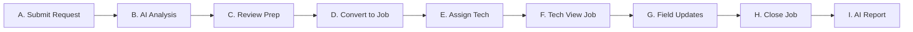

# ServiceForge AI — UI / UX Design & Navigation Specification

**Version:** 1.0.0  
**Project:** ServiceForge AI  
**Design Direction:** Enterprise B2B SaaS (Restrained, Modern, High Information Density)  

---

## 1. Visual Design System & Aesthetic Guidelines

### 1.1 Aesthetic Philosophy
ServiceForge AI targets high-stakes B2B service operations. The visual system is tailored to be:
- **Restrained & Professional:** Slate-based dark theme (`slate-950` background, `slate-900` card containers, `slate-800` borders).
- **High Information Density:** Compact padding, clean tabular structures, status badges, clear grid alignment.
- **Strong Visual Hierarchy:** Crisp typography hierarchy (Inter font family), high contrast text (`slate-100` headings, `slate-400` body text).
- **Iconography:** Lucide Icons (`lucide-react`) used purposefully for visual anchors.
- **Strictly Avoid:** Cartoonish designs, bright neon accents, excessive glassmorphism, heavy gradient backgrounds, or slow distracting animations.

### 1.2 Color Palette Tokens

| Palette Role | Tailwind v4 Token / Hex | Usage |
| :--- | :--- | :--- |
| **Canvas Background** | `bg-slate-950` (`#020617`) | Main application background |
| **Surface Container** | `bg-slate-900` (`#0f172a`) | Cards, panels, sidebar, table containers |
| **Surface Border** | `border-slate-800` (`#1e293b`) | Structural lines, table dividers |
| **Primary Text** | `text-slate-100` (`#f8fafc`) | Headings, titles, data values |
| **Secondary Text** | `text-slate-400` (`#94a3b8`) | Labels, descriptions, timestamps |
| **Brand Accent** | `cyan-500` (`#06b6d4`) | Primary buttons, active tab indicators, key badges |
| **Success / Available** | `emerald-500` (`#10b981`) | Completed status, technician online, verified badge |
| **Warning / High Priority** | `amber-500` (`#f59e0b`) | Pending review, medium-high priority, LOTO safety warning |
| **Danger / Critical** | `rose-500` (`#f43f5e`) | Critical SLA warning, equipment offline, error state |

---

## 2. Navigation Structure & Route Table

| Path | Screen Name | Access Roles | Screen Purpose & Key Elements |
| :--- | :--- | :--- | :--- |
| `/` | **Operations Dashboard** | All Roles | Overview of active jobs, SLA countdowns, triage queue, technician utilization heatmap, recent AI extractions. |
| `/requests` | **Service Requests** | Service Mgr, Dispatcher, Customer | Central intake queue. Displays raw requests, AI analysis status, and side-by-side decision review drawer. |
| `/jobs` | **Service Jobs Board** | Service Mgr, Dispatcher, Technician | Kanban / tabular dispatch board tracking job states (Unassigned -> Assigned -> In Progress -> Completed). |
| `/technicians` | **Technicians & Dispatch** | Service Mgr, Dispatcher | Technician directory, live status, skill matrix matching, and route dispatch assignment tool. |
| `/customers` | **Customers Directory** | Service Mgr | B2B customer accounts, SLA tiers, site locations, and service history logs. |
| `/assets` | **Equipment Registry** | Service Mgr, Dispatcher, Tech | Maintenance history per asset, serial numbers, installed location, and active service requests. |
| `/reports` | **Service Reports** | All Roles | Archive of completed job reports, customer sign-off statuses, and PDF generation previews. |
| `/settings` | **Platform Settings** | Service Mgr | AI prompt parameters, Bedrock model selection, user role management, and integration keys. |

---

## 3. Key User Flows (A through I)



### Detailed Flow Specifications:

#### Flow A: Creating a Service Request
- User (Customer or Service Manager) clicks **"+ New Request"**.
- Fills minimal fields: Customer Account, Target Equipment (optional), and Raw Issue Description text box.
- Option to attach voice recordings or site photos.
- Submits request -> Triggering status `SUBMITTED`.

#### Flow B: AI Analyzing the Request
- Triggered automatically upon request submission.
- UI displays an elegant pulse indicator: *"Amazon Bedrock analyzing unstructured input..."*.
- Extracts issue summary, symptoms, priority, required tools, parts, safety rules, and missing info.

#### Flow C: Reviewing AI-Generated Job Preparation
- Service Manager opens the request detail view.
- **Side-by-Side Review Screen:**
  - **Left Panel (User Input):** Raw text submitted by customer + uploaded photos.
  - **Right Panel (AI Decision Support):** Structured extractions (Priority badge, suggested checklist, required tools, safety alerts).
- Service Manager can edit or confirm any suggested step.

#### Flow D: Converting Request into a Service Job
- Manager clicks **"Approve & Create Service Job"**.
- System generates official `ServiceJob` record (`JOB-2026-XXXX`).
- Request status updates to `APPROVED`.

#### Flow E: Assigning a Technician
- Dispatcher opens job assignment modal.
- System recommends top 3 technicians based on:
  1. Skill match percentage (e.g., L3 Pneumatics certified).
  2. Availability schedule & geographic proximity.
- Dispatcher confirms assignment -> Status transitions to `ASSIGNED`.

#### Flow F: Technician Viewing the Job
- Technician opens ServiceForge app on mobile/tablet.
- Views assigned job package:
  - Equipment location & access details.
  - **Safety Guidelines Banner** (Must check *"I acknowledge LOTO procedures"*).
  - Required tools checklist & expected replacement parts.

#### Flow G: Technician Updating Service Progress
- Technician executes service on site:
  - Taps step-by-step inspection checklist items as completed (`[x]`).
  - Logs actual replacement parts used.
  - Attaches final repair photo.
- Updates job status to `WORK_COMPLETED`.

#### Flow H: Closing the Job
- Service Manager reviews technician updates and photos.
- Verifies all mandatory checklist steps are completed.
- Marks job status as `COMPLETED`.

#### Flow I: Generating Final Service Report
- One-click trigger to Bedrock: *"Generate Customer Service Report"*.
- AI compiles raw field notes into a polished PDF document containing executive summary, work performed log, parts list, and sign-off blocks.
- Customer receives notification to review and sign off.

---

## 4. AI Analysis Interface Layout Specification

The AI Analysis UI must strictly adhere to the decision support philosophy:

```text
+---------------------------------------------------------------------------------------------+
| SERVICE REQUEST DETAIL: REQ-2026-0841                                  [ PENDING MANAGER REVIEW ] |
+---------------------------------------------------------------------------------------------+
|                                                                                             |
|  USER REPORTED INFORMATION                 |  AI DECISION SUPPORT RECOMMENDATIONS           |
|  ----------------------------------------  |  --------------------------------------------  |
|  Submitted By: Industrial Plastics Corp    |  Suggested Priority: [ HIGH ] (Confidence: 94%)|
|  Asset: Air Compressor AC-4500 (Unit 3)    |  Target Skill: Senior HVAC / Pneumatics L3    |
|                                            |                                                |
|  Raw Description:                          |  Detected Symptoms:                            |
|  "Our industrial compressor starts         |  - Heavy operating noise                      |
|  normally but becomes very noisy and shuts |  - Thermal/pressure shutdown after ~10 mins   |
|  down after about ten minutes."            |                                                |
|                                            |  Suggested Inspection Steps:                   |
|  Attached Files:                           |  [ ] 1. LOTO electrical lockout procedure      |
|  - compressor_noise_audio.m4a              |  [ ] 2. Inspect cooling fan & belt tension     |
|                                            |  [ ] 3. Check thermal cutoff sensor wiring     |
|                                            |                                                |
|                                            |  Safety Warnings:                              |
|                                            |  ⚠ Thermal burn hazard on compressor head      |
|                                            |  ⚠ High-voltage LOTO required                  |
|                                            |                                                |
|                                            |  Missing Information:                          |
|                                            |  ❓ Digital panel error code log not provided   |
|                                            |                                                |
+---------------------------------------------------------------------------------------------+
| [ Reject Request ]                                [ Edit AI Specs ]  [ Approve & Create Job ]|
+---------------------------------------------------------------------------------------------+
```
